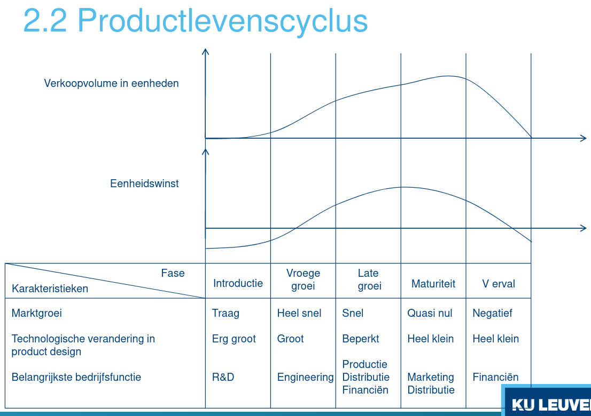

# Bedrijfskunde

Examen: gesloten boek, set kleine vragen, 2 vragen ivm inzicht en vaardigheden (hdskt samenbrengen, ) /!\ Formules moeten in context gebruikt worden, anders fout

## Deel 1: Ondernemerschap

Zo oud als mensheid => al sinds 5k voor jc
  - staatssysteem in china sinds 3k voor jc
  - pyramides
  - de code van Hammurabi, voorzag reeds minimumlonen
  - ...

Managementtheorien volgen:
  - Henri Towne (1886): "the engineer as economist"
  - Frederik Taylor (1911): wetenschappelijk productiebeheer
  - Henri Fayol (1916): Prevoir, organiser, commander, coordiner, contrôler

Evolutie over de tijd heen: bedrijven worden complexer, klant komt centraal te staan, groen,....

Technische vaardigheden niet op eerste plaats (#6), maar wel belangerijk in combinatie met leiderschap, intuitie, charisma

Entrepreneur: leiderschap- en managementkwaliteiten maar ook goede dosis kennis inzake beleidstechnieken

Missie/strategie verandert in functie van de jaren, in functie van verwachtingen klant, aandelhourders,....

Grondslag van ons systeem: Meerwaarde (MW)
MW = I - U = Vl + Vg + Vk + AF
met I = inkomen van de onderneming, U = uitgaven aan derden

- Vl = vergoeding voor lonen
- Vg = vergoeding voor de gemeenschap (belastingen + sociale
bijdragen)
- Vk = vergoeding voor het kapitaal
- AF = autofinanciering

Finaliteit van de onderneming

Levenscyclus => inovere of niet, afhankelijk deels van competitie
Rivaliteit => als veel concurencie heeft koper minder macht, andersom (vb. colruyt en nutella)

Langertermijnvisie <-> kortetermijnwinst

Duurzaamheid is belangerijk concept!

Inovatie en ondernemen onlosmakelijk met elkaar verbonden
=> Inovatie van levensbelang

belangerijke parameters: kost, kwaliteit, tijd en dienst na verkoop

Entrepreneurship: creeren van een bedrijf dateen probleem oplost

Intrapreneurship vs Entrepreneurship => een van binnen, andere algemeen

Kenniscentra: valorisatie van onderzoek => spin off

Mogelijke hinderpalen voor spin offs en start ups:
  - geldkapitaal
  - productidee
  - aantrekken van goede medewerkers
  - administratieven en juridische problemen (bv. keuze van de vennotschapsvorm, kapitaalstructuur,...)
  - ...

=> enkel 1/3 van de nieuwe bedrijven overleven eerste jaar

## Deel 2: Innovatie en Productlevenscyclus

Productielevenscyclus => herkenbare stadia, geldt voor zowel materiele en imateriele

Stadia op basis van verkocht volume:
  - Introductie
  - vroege groei
  - maturiteit
  - verval

Foothill: eerste piek door "try hards", tweede piek van mensen die reactie van "try hards" afwachten om hem eventueel te kopen

Mode producten: heel populair op een moment t, maar enkele momenten later niet meer

Gronstoffen en energiebronnen apart => langdurige maturiteit: blijft (heel/oneindig) lang stabiel qua inkomsten

PLC fase => heeft impact op manier van produceren

Meestal verschillende producten in verschillende fasen

Flowshop => een product dat productielijn volgt (massaproductie)
Job shop => meerdere producten die door verschillende workshops passeert, in verschillende volgorde (niet perse allemaal dezelfde workshops) (precisie/replacement parts)

PLC wordt steeds korter
