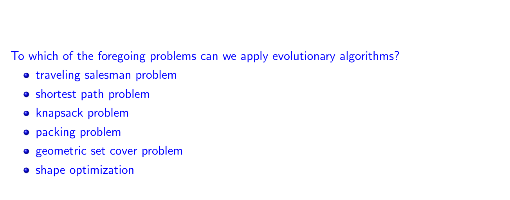

# Problems, representation and variation

To all of them (but some will be more efficient depending on location between exploration and exploitation)

Due to grounding errors => imagine one column and one row matrix, with reals: multiplying them would result in rounding errors and would thus not represent the result (it will be an approximation). As such, depending on the purpose of the code, it might not be of use, in which case the indirect representation should be used.

342 means that 3 is mapped to 4, 4 is mapped to 2 and 2 is mapped to 3 => creates a graph
7 means that it is a cycle with one node: 7
