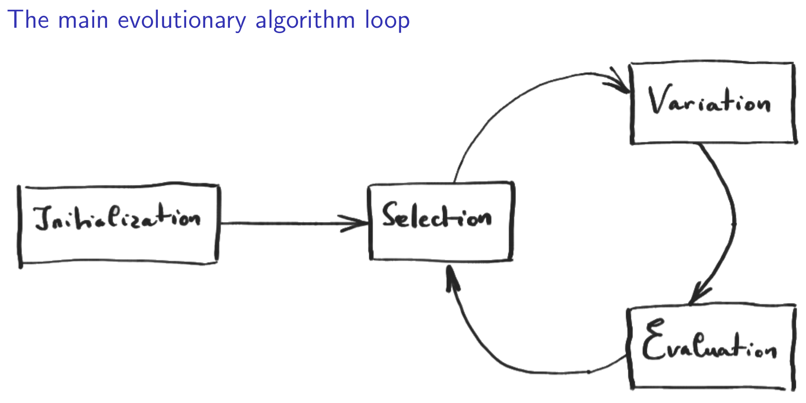

# Evolutionary Algorithms

## Introduction

Nick Vannieuwenhoven

No theory! *

*Strict mathematical sense only => should be able to explain the different methods, but no definition or proof to know

3 lectures, then discussion & online modules

12+2 points on the project, 6 points on the exam

## exploration vs Exploitation

Random search / Monte Carlo sampling methods => randomly sample elements of the domain D, computing the function value and record the minimum

