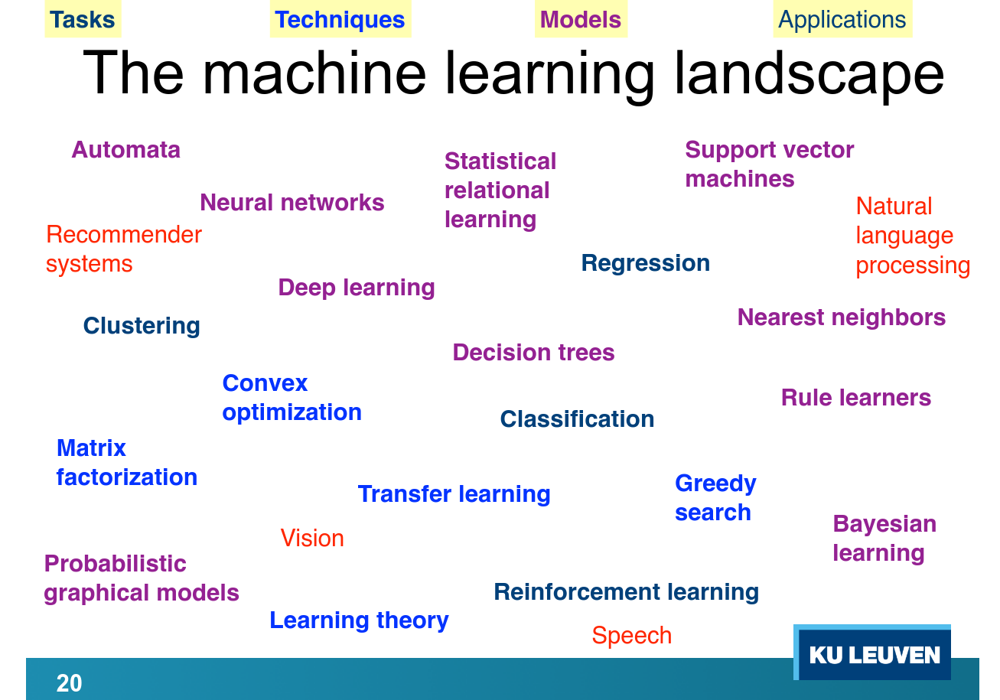
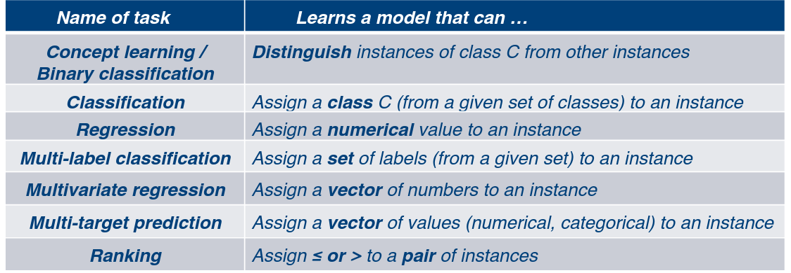

# Beginselen van Machine Learning // Principles of Machine Learning

H. Blockeel, Kimmig, De Raedt, Davis

Study material: slides + recordings + reader

Written exam, closed book, with formula sheet

### What is Machine Learning (ML)

In what context?
  - DLSS
  - Recommendation systems (amazon, youtube,...)
  - Self driving cars
  - Language Learning
  - And much more

Definition:
>ML is the study of how to make programs improve their performance on certain tasks from (own) experiences

With performance = speed, accuracy,...
     experiences = earlier observations

Useful for anything that we don't know how to program (computer programs itself)
Link to AI => computer solves hard problems autonomously

In ML, the key is data
  - Examples of questions & their answer
  - Observations of earlier attempts to solve some problems

ML makes use of inductive inference: reasoning from specific to general

AI != ML != Deep Learning

ML in typical form:
  - Input = dataset
  - Output = some kind of model
Ml in general form:
  - Input = knowledge
  - Output = a more general form of knowledge

A generic approach is to find informative features (lightness, width, length,...) then find a line.curve/hyperplane... to determine result (/!\ Not perfect => underfitting and overfitting)

## Different properties
### Predictive vs Descriptive
Predictive : learn a model that can predict a particular property /attribute/variable from inputs

ex: face recognition, spam filtering,...

Descriptive: given a data set, describe certain patterns in the dataset

ex: analysing large databases,

### Multiple learning models:
  - Distribution learning  (see slide 31)
  - Function learning (see slide 32)

### Parametric vs non-parametric
### Explainable AI
XAI (explainable AI) refers to the study of AI systems that can explain their decision/whose decisions we can understand. 2 levels:
  - We understand the learned model used of decision making
  - we understand the individual decision

## Responsible AI: Challenges
Privacy preserving data analysis
Learning *safe* models: models that will not violate certain constraints that are imposed (no bias,...)

## Predictive in depth
Training set: a set of examples
Prediction set: a set without labels, used to test model/ predictions
Interpretable vs. black-box
Inductive (gives function to predict result) vs transductive (predicts result)

### Different levels of supervision:
- Supervised learning: learning a (predictive) model from labelled instances (as in cats & dogs example)
- Unsupervised learning: learning a model from unlabelled instances
- Semi-supervised learning: learn a predictive model from a few labelled and many unlabelled examples

PU-learning is a special case of semi-supervised => stands for positive or unlabelled (so no negative)

Weakly supervised learning is a generalized form of semi-supervised learning: allows to have partial information about a label (it is certainly a member of a given set (ex, it is a car, but can not give model),...)

## Format of Input data

Input is often assumed to be a set of instances that are all descried using the same variables (features, attributes):
  - the data are independent and identically distributed
  - the training set can bet set
  - The training set can be seen as a random sample from one distribution
  - The training set can be shown as a table (instances x variables) : tabular data
  - This is also called the standard setting

There are other formats: instances can be
  - nodes in a graph
  - whole graphs
  - elements of a sequence
  - trees
  - ...

Examples: see slides 52-59

### Data preprocessing
Data may not be in a format that your learner can handle
**Data wrangling**: bring it into the right format
**Feature selection**: select among many input features the most informative ones
**Feature construction**: construct new features, derived from the given ones

### So, which learning method to use?
 => strongly dependent on problem, the data format and the learning tasks impose strong constraints on which learning methods can be used.(along with other aspects such as noise, bias,...)

### Missing data
three possibility:
  - leave out of training set (information loss)
  - guess the missing value (what if guess is wrong)
  - treat ? as a separate value

## Format of output formats
The output of a learning system is a model

Many different types of model exist

The learning algorithm or method is strongly linked to the type of model

High-level overviews of machine learning methods often categorize them along this axis

examples see slides 67-73

### Search methods
How do we find the most suitable model?
  - Sometimes, there is a closed form solution (e.g., linear regression)
  - If not, we typically need to search some hypothesis space
  - Two very different types of spaces, each with their own search methods :
    - Discrete spaces (methods: hill-climbing, best-first, ...)
    - Continuous spaces (methods: gradient descent, ...)
  - Typically:
    - Model structure not fixed in advanced => discrete
    -Fixed model structure, tune numerical parameters => continuous
