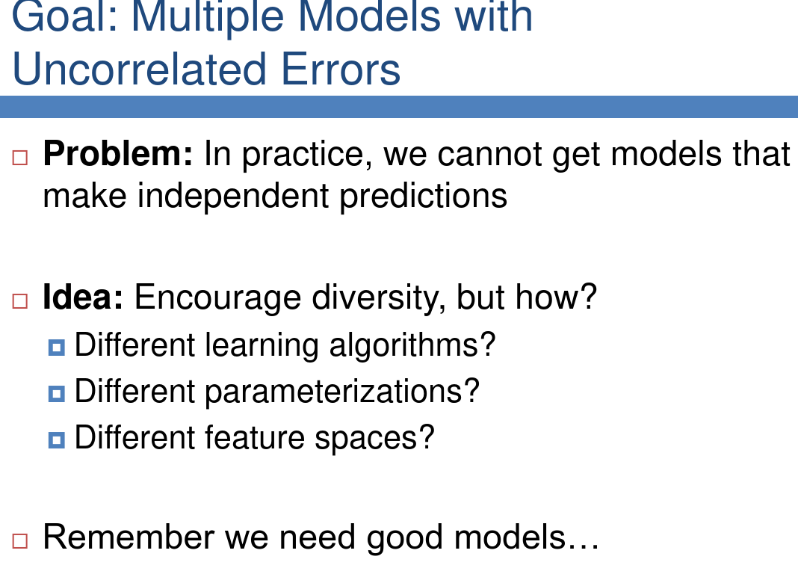
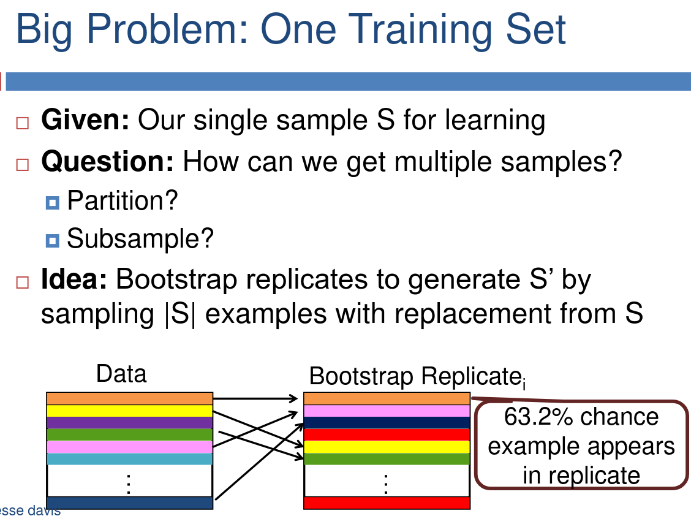
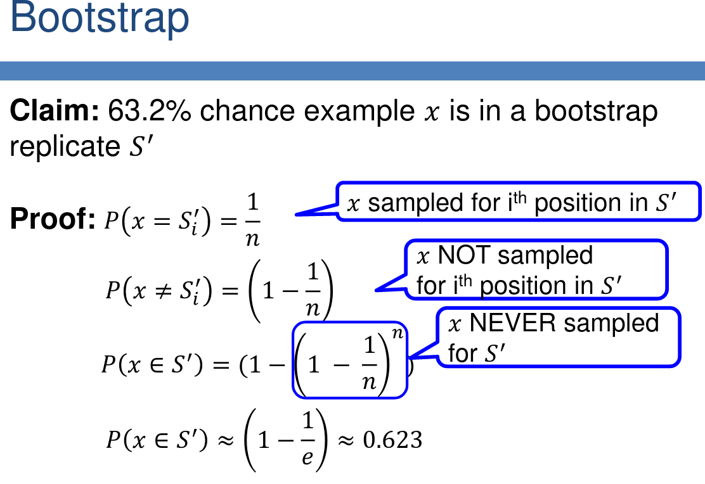
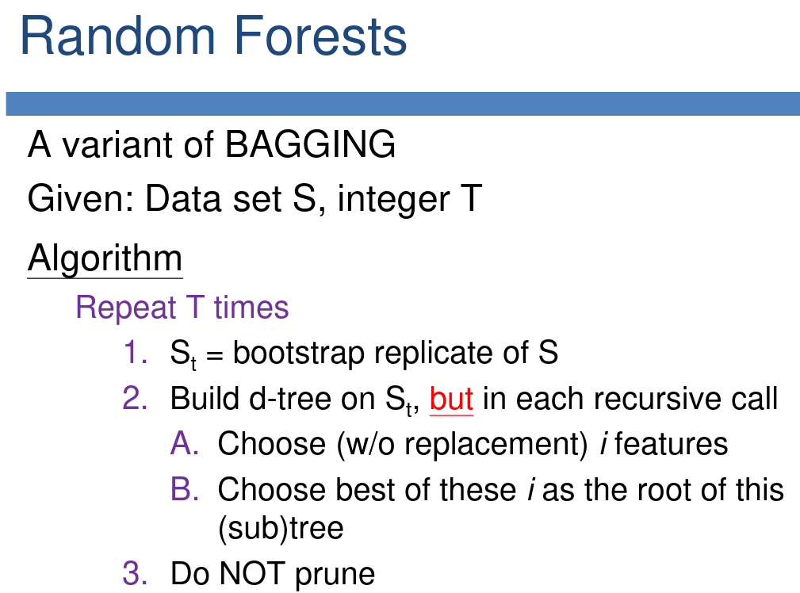

# Ensemble methods

slide 1 => example of jelly jar: either pick number, or average of other people's pick => best to take average: some will overestimate, others underestimate

Same is applicable to models => if all models are independent, average is best

3 key questions:
  1. How do we generate multiple different models?
  2. How do we combine the different predictions?
  3. What models should we consider?

## BAGGING AND RANDOM FORESTS

Ensures that there is "more" data while maintaining independence

why 63.2%?

### Bagging: Bootstrap Aggregating
Given: data set S, integer T
  - for t=1,...,T: St = Bootstrap replicate of S
                  ht = Apply learning algorithm to St
  - Classify test instance using unweighted vote

Works with  any learner, but best with unstable ones (a learner is unstable if minor variations in training data results in major changes in classifier output)

will add some randomization, will be faster, works very well in practice

Extreme random forests => variant, which works with an unweighted vote

### Boosting

slide 18 => strong = small error

models learn from previous models (the second from the first, the third from the first two,...)

slide 29 => count weighted error

### MANIPULATING INPUTS AND OUTPUTS

Different learners see different subsets of features (of each training instances)

Technique works best when input features are highly redundant
