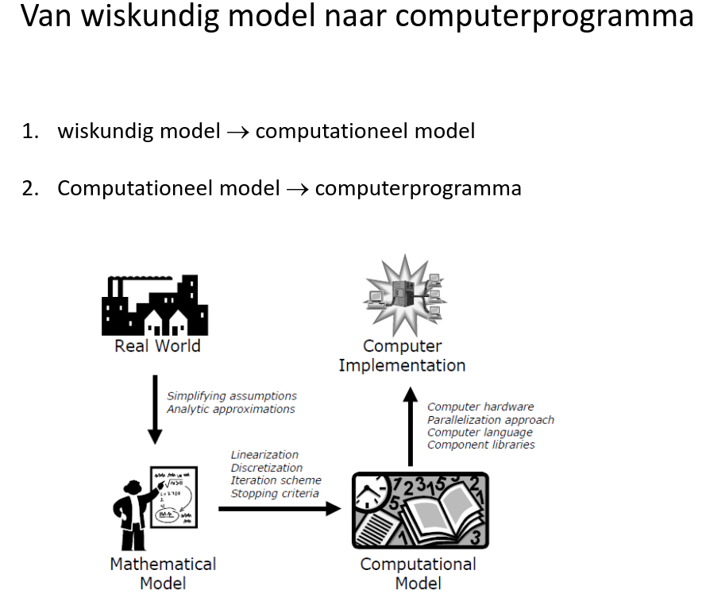
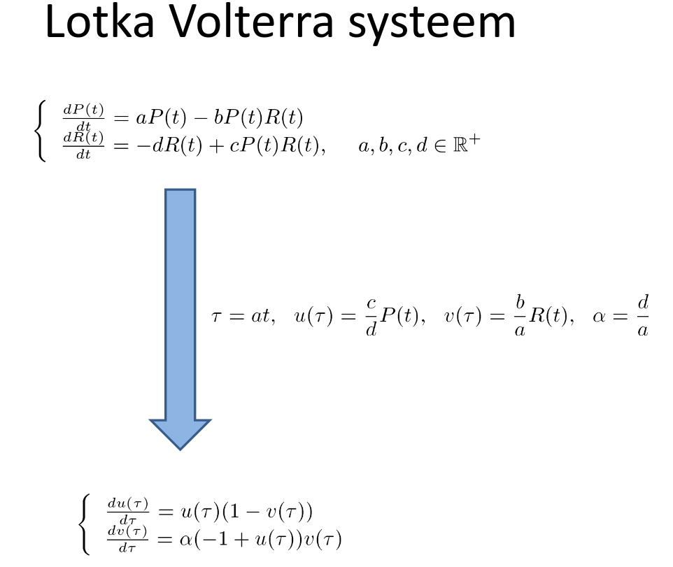
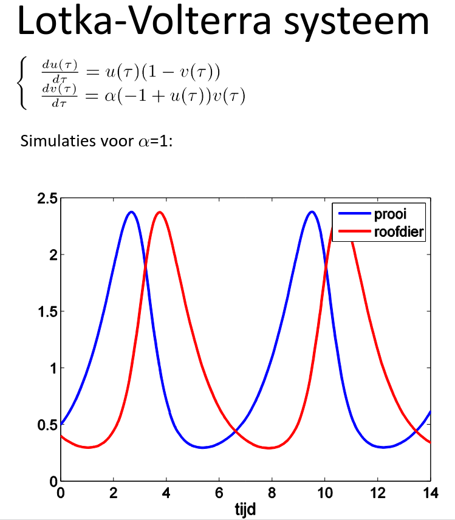
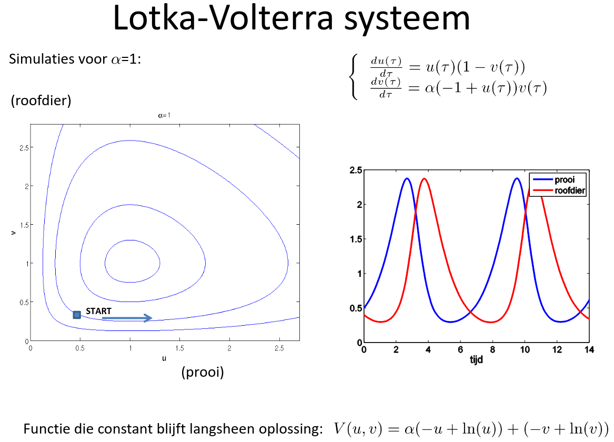

# Modelering & simulatie

Examen => schriftelijk, gesloten boek, open vragen 16pt
Project => 2 practica, elk voor 2 pt, Verplicht!!!

## Modellen
verzammeling van variabelen, en de linken met elkaar

Classificatie:
  - discrete of continue
  - lineair of niet -lineair
  - deterministich of stochastisch
  - lumped of gedistribueerd (lumped => eindig aantal toestands variabelen, gedistribueerd oneindig)
  - white of black box (white indien op basis van physische wetten, black indien niet) (Grey box bestaat ook => combinatie van de twee)

## simulatie

nabootsing van (de werking van) een systeem

  - door mensen uitgevoerd
  - computersimulatie

waarom virtueel simuleren?
    - gedrag voorspellen, begrijpen
    - goedkopen dan fysisch experiment
    - geen fysisch experiment mogelijk

Als geen roofdieren => P'=aP, µ-a = 0, P(t) = ge^(at) => bevolking vissen stijgen exponentieel

Als geen prooien, bevolking roofdieren exponentieel naar beneden

d/d2  V(u/r, v/r) = a (-1+1/u) (u(1-b)) + (-1 + 1/v) (-A + &/v) = 0 => dus constant

## Inleiding
Inhoud:

1. Modellen en simulaties
2. Numerieke Lineaire Algebra
3. Optimalisatie
4. Trigonometrische Benaderingen
5. Toevalsgeneratoren
6. Discrete-Event Simulaties
7. Markov Kettingen
8. Monte-Carlo Simulaties
